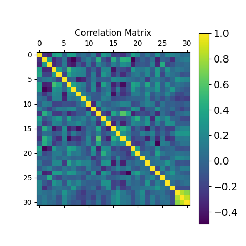
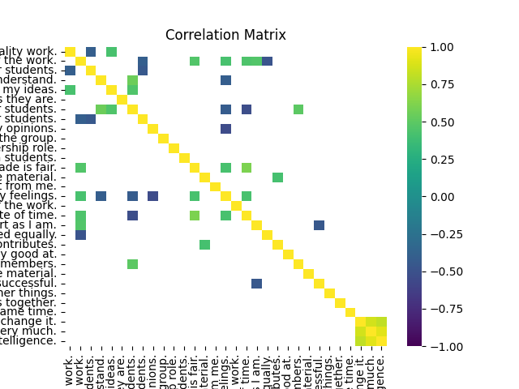
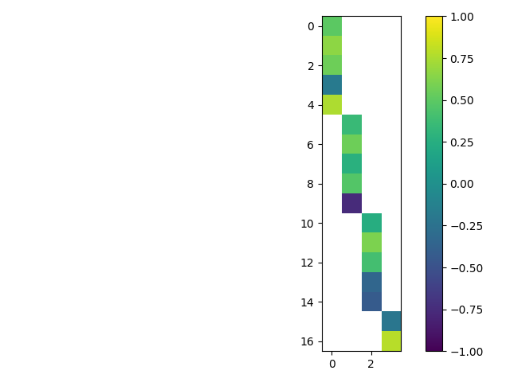
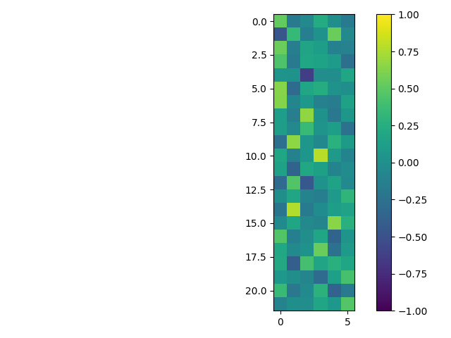
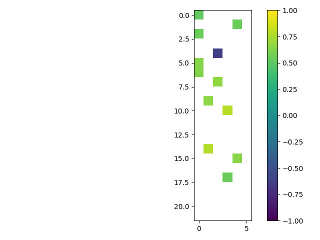
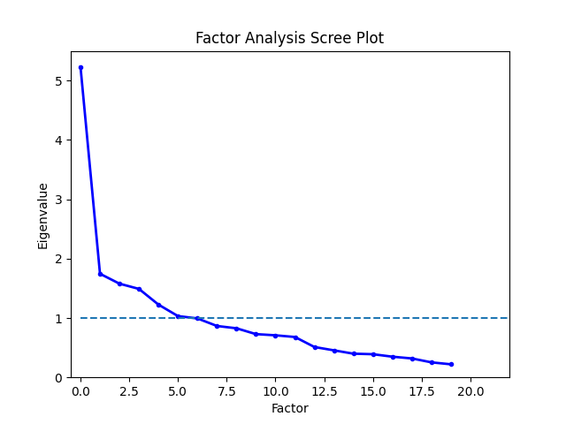
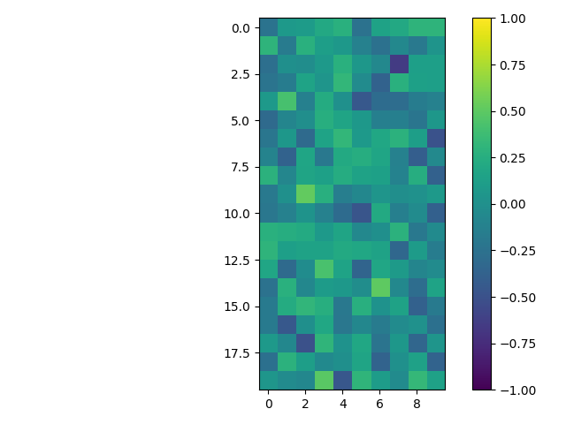
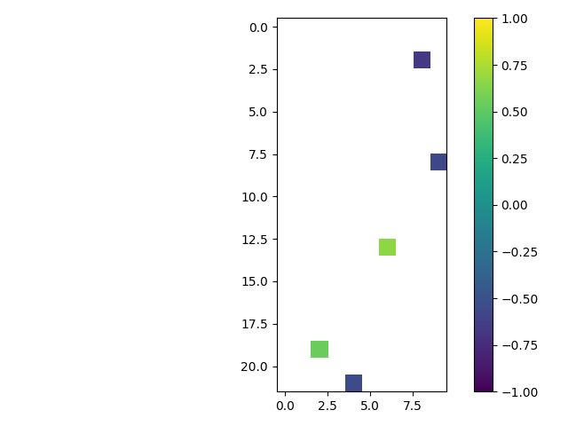
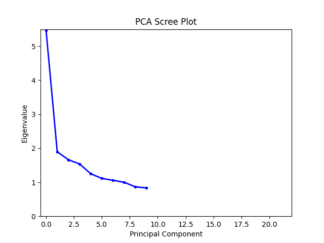
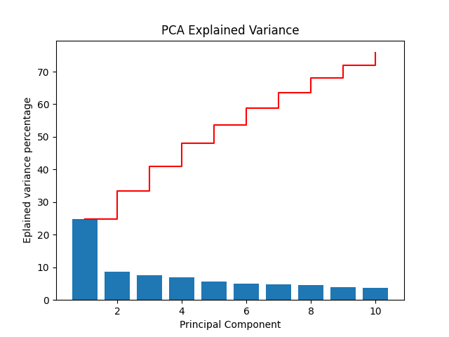

# Group Dynamics project Code

Repository of files used for analysis of data in the Group Dynamics project at UT Austin.
All files written using Python 3.8.10

Python analysis code are:
- BasicAnalysis.py: this is an old code that produced the initial figures in Sp22.
- AnonyData.py: The file used to scrub traceable student results from raw data files.
- PCA.py: The file used to do Principle Component Analysis on the SAGE Survey.

To run SAGE analyis:
1.	In the Qualtrics survey, go to the “Data and Analysis” tab. 
2.	Then on the right side, use the “Export & Import” dropdown menu to Export Data. Make sure that “Use choice text” is selected and export the data as a CSV.
3.	Move the downloaded file to the same location as the .py file you intend to use.
4.	Make sure you have a folder called "ExportedFiles" in the same location. This is where any figures, csv/png files will be outputted.
5.	Run the desired .py file.

## Produced files
- Sage_Raw.csv: Raw data from all submissions, changed from qualtrics to include only relevant responses and converted Likert response to integer
- SAGE_Stats.csv: Calculated values of mean, std.dev., and percentages of responses for SD+D, N, SA+A
- SAGE_Comps.csv: Factor analysis values of only the SAGE questions 
- Sage_CorrM.csv: Values for the correlation matrix of SAGE questions
- SAGE_GenSig.csv: Statistical values for comparison between male and female students

## Statistical tests
- Bartlett's test of sphericity: $\chi^2 = 734$, $p = 1.7\times 10^{-48}$
- Kaiser-Meyer-Olkin (KMO) measurure of sampling adequacy: 0.749

## Produced images
Correlation Matrix

Correlation Matrix (showing all correlations >0.4)

Confirmatory Factor Analysis

Exploratory Factor Analysis and associated Scree Plot of SAGE questions

Principle Component Analysis and associated Scree plot

