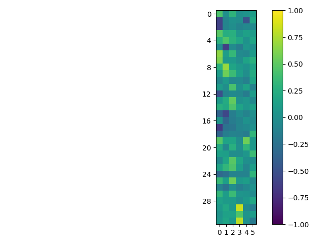

# Group Dynamics Project Code

Repository of files used for analysis of data in the Group Dynamics project at UT Austin.
All files written originally using Python 3.8.10, now run in Python 3.11.0  (so some functions don't work yet).

Python survey analysis code are:
- AnonData.py: The file used to scrub traceable student results from raw data files.
- BasicAnalysis.py: this is an old code that produced the initial figures in Sp22. I keep it as a place to keep some old functions
- SAGE.py: The file used to conduct any analysis on the SAGE Survey.

To get SAGE data:
1.	In the Qualtrics survey, go to the “Data and Analysis” tab. 
2.	Then on the right side, use the “Export & Import” dropdown menu to Export Data. Make sure that “Use choice text” is selected and export the data as a CSV.
3.	Move the downloaded file to the same location as the .py file you intend to use.

Running the code:
1.	Make sure you have a folder called "ExportedFiles" in the same location. This is where any figures, csv/png files will be outputted.
2.	Run the desired .py file using Python 3.11.0.

## Produced files
- SAGE_CFA.csv: Loadings for each of the SAGE questions using confirmatory factor analysis
- SAGE_CorrM.csv: Values for the correlation matrix of all survey questions
- SAGE_Counts.csv: Counts fo respondents for a variety of demographics
- Sage_Raw.csv: Raw data from all submissions, converted Likert response to integer values instead of strings
- SAGE_Stats.csv: Calculated values of mean, std.dev., and percentages of responses for SD+D, N, SA+A

## Statistical tests
- Bartlett's test of sphericity: $\chi^2 = 11000$, $p = 0.00$
- Kaiser-Meyer-Olkin (KMO) measurure of sampling adequacy: 0.904

## Produced images
Correlation Matrix
Labels = 

Correlation Matrix (showing all correlations >0.4)

Confirmatory Factor Analysis for questions that correspond to Kouros and Abrami 2006.

Exploratory Factor Analysis and associated Scree Plot of survey questions

