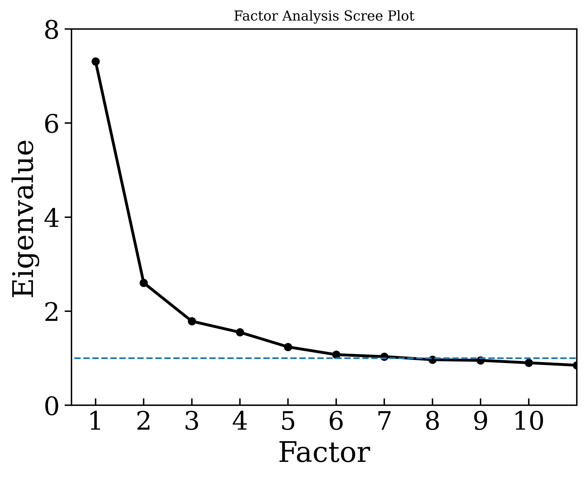

# Group Dynamics Project Code
Repository of files used for analysis of data in the Group Dynamics project at UT Austin.
All files written originally using Python 3.8.10, now run in Python 3.11.0  (so some functions don't work yet).

Python survey analysis code are:
- AnonData.py: The file used to scrub traceable student results from raw data files.
- BasicAnalysis.py: this is an old code that produced the initial figures in Sp22. I keep it as a place to keep some old functions
- SAGE.py: The file used to conduct any analysis on the SAGE Survey.

To get SAGE data:
1.	In the Qualtrics survey, go to the “Data and Analysis” tab. 
2.	Then on the right side, use the “Export & Import” dropdown menu to Export Data. Make sure that “Use choice text” is selected and export the data as a CSV.
3.	Move the downloaded file to the same location as the .py file you intend to use.

Running the code:
1.	Make sure you have a folder called "ExportedFiles" in the same location. This is where any figures, csv/png files will be outputted.
2.	Run the desired .py file using Python 3.11.0.

## Produced (relevant) files
- SAGE_CFA.csv: Loadings for each of the SAGE questions using confirmatory factor analysis
- SAGE_CorrM.csv: Values for the correlation matrix of all survey questions
- SAGE_Counts(1,2).csv: Counts for respondents for a variety of demographics
- Sage_Raw.csv: Raw data from all submissions, converted Likert response to integer values instead of strings
- SAGE_Stats.csv: Calculated values of mean, std.dev., and percentages of responses for SD+D, N, SA+A

## Confirmatory Factor Analysis
Only questions that correspond to Kouros and Abrami 2006.

The factor_analayzer.cfa package in Python fails to converge on a solution so the data is exported to conduct the CFA in R. This is true for all circumstances of CFA.

To compare to the original loadings, we can use Pearson's correlation coefficient (r) which is a measure of how linearly correlated (scaled [-1,1]) two sets of data are. For our results to be correlated to the previous work, I would expect r~1. 

With these loadings, we get r = 0.246 (p-score ~ 0.3) which indicates a poor agreement. In particular, we see that while most items agree, there are several that do not agree well:
 - The material is easier to understand when I work with other students (quality of product and process)
 - The work takes more time to complete when I work with other students (quality of product and process)
 - When I work in a group, I am able to share my ideas (peer support)
 - I learn to work with students who are different from me (student interdependence)
 - When I work with other students, we spend too much time talking about other things (frustrations with group members)
 
If these 5 items are removed, then we get a moderately good agreement r = 0.636 (p = 0.01).

## Exploratory Factor Analysis 
Correlation Matrix
Labels = 

Correlation Matrix (showing all correlations >0.4)

Bartlett's Test of Sphericity (tests whether a matrix is different to the identity matrix, or if it can be factored): $\chi ^2$ = 11502.2, p = 0
Kaiser-Meyer-Olkin measure of sampling adequacy (above 0.8 is ideal): 0.906

First, we produce the Scree plot to determine the ideal number of factors for analysis

We can see that there is an ambiguous result as to the number of factors assuming the Kaiser Criterion ($ \epsilon >1 $). Therefore we need another metric to know the number of factors needed for analysis. Therefore we use an algorithm, described in detail in Eaton et al. (Phys. Rev. Phys. Educ. Res. 15, 010102 (2019).

1. Calculate the Kaiser-Meyer-Olkin (KMO) values for every item. If any items have a KMO below the cutoff value, then the item with the lowest value is removed and the step is repeated. KMO values above 0.6 are kept, though above 0.8 are preferred.
  - KMO measures the suitability for factor analysis by estimating the proportion of variance among all observed variables
2. Check whether the items can be factored using Bartlett's test of sphericity. A low p-score indicates that factor analysis can be performed.
  - Compares the correlation matrix to the identity matrix (checks whether there are correlations)
3. Calculate the EFA model using factoring and a specified number of factors.
4. Calculate the commonalities, which are the proportion of the item's variance explained by the factors. If any item is below the cutoff (<0.2), then the item with the lowest value is dropped and then restart at Step 1.
5. Calculate the item loadings. If there are items that fail to load to any factor, then remove the item with the smallest max loading and then restart at Step 1.
6. Create a model for the CFA by placing each item onto the factor that contains the item's largest loading. If any items load equally onto more than one factor, then add to all factors where this is the case.
7. Fit this model using Confirmatory Factor Analysis and extract a fit statistic (Akaike information criterion, or similar) to be used as a comparison for the ideal number of factors.
8. Change the number of factors and repeat the above steps.
9. Plot the fit statistic vs the number of factors. The model with the local minimum index is the preferred model.

Here we can see that the optimal number of factors is 8 because it is the local minimum of the fit statistic (meaning it explains the most amount of variance). Interestingly (maybe a mistake with the code?), one of the factors has no major loadings so the difference between 7 and 8 factors is how the items are distributed in each of the factors.

The factors are:
1. 'When I work in a group, I end up doing most of the work.', 'The work takes more time to complete when I work with other students.', 'The material is easier to understand when I work with other students.', 'The workload is usually less when I work with other students.', 'I do not think a group grade is fair.', 'I feel working in groups is a waste of time.', 'When I work with other students the work is divided equally.'
2. 'When I work in a group, I am able to share my ideas.', 'My group members make me feel that I am not as smart as they are.', 'My group members respect my opinions.', 'I feel I am part of what is going on in the group.', 'My group members do not care about my feelings.'
3. 'You have a certain amount of physics intelligence, and you can’t really do much to change it.', 'Your physics intelligence is something about you that you can change.', 'You can learn new things, but you can’t really change your basic physics intelligence.'
4. 'I learn to work with students who are different from me.', 'I also learn when I teach the material to my group members.'
5. 'I prefer when the leadership role rotates between students.', 'I try to make sure my group members learn the material.', 'Everyone’s ideas are needed if we are going to be successful.', 'My group did higher quality work when my group members worked on tasks together.'
6. 'I have to work with students who are not as smart as I am.', 'I become frustrated when my group members do not understand the material.'
7. 'My group members help explain things that I do not understand.'

