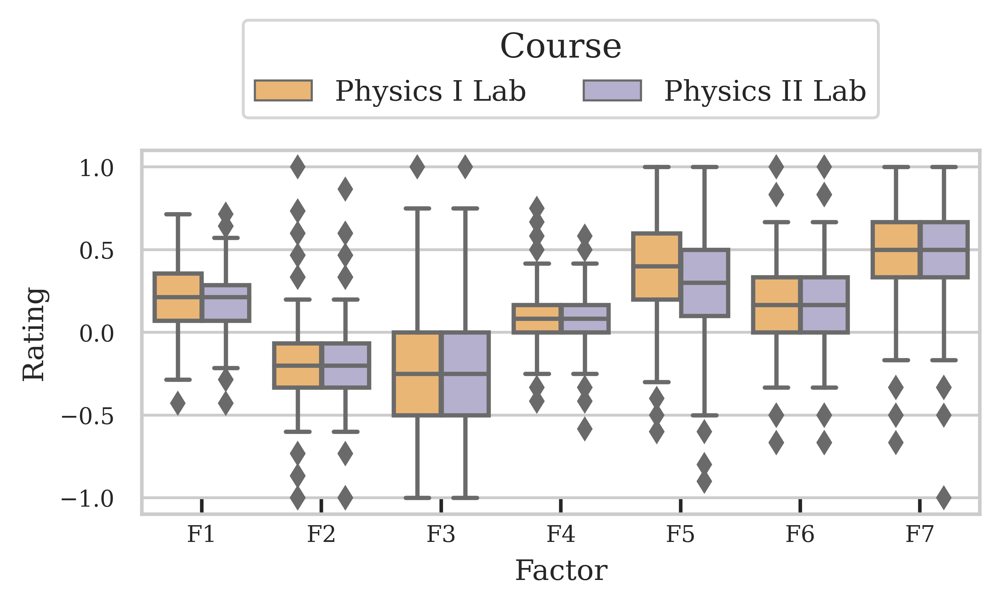
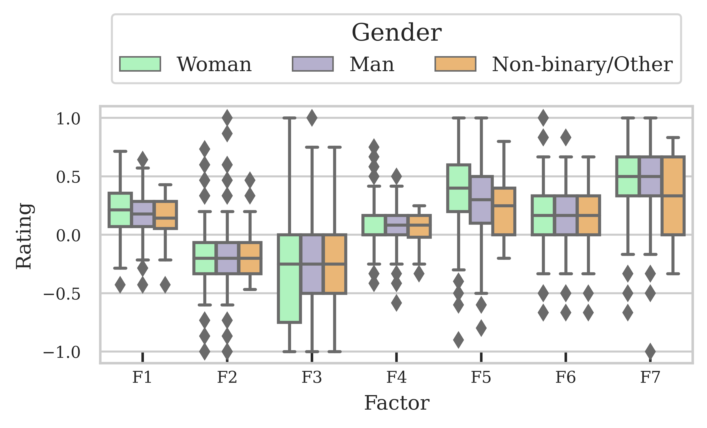
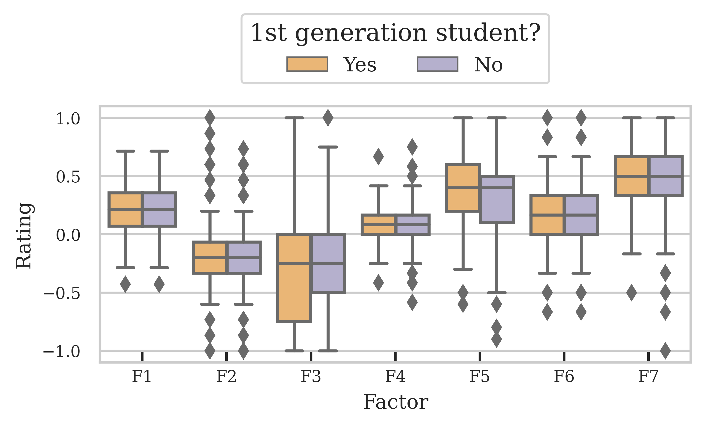
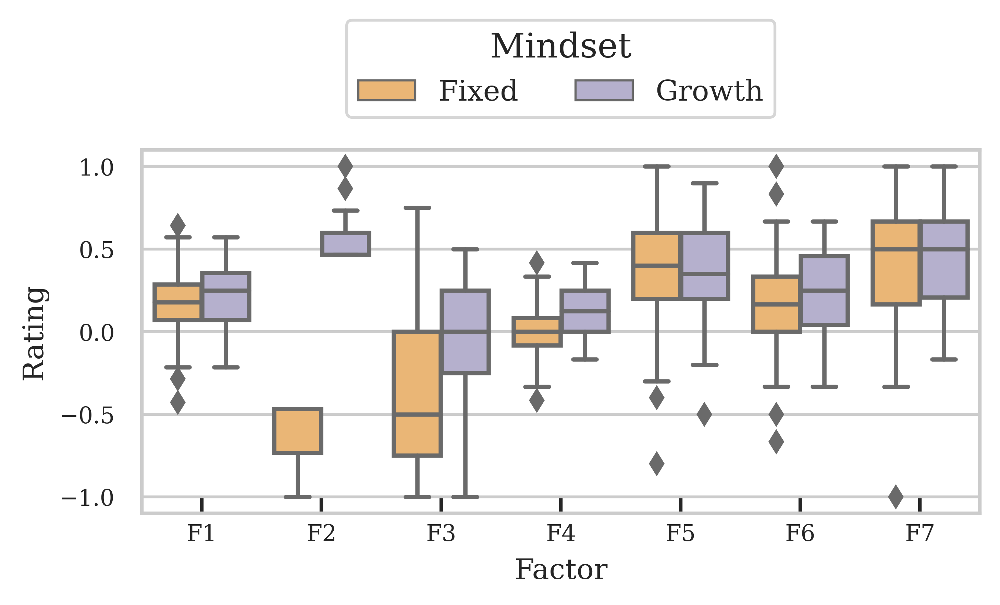

# Group Dynamics Project Code
Repository of files used for analysis of data in the Group Dynamics project at UT Austin.
All files written using Python 3.11.0.

Python survey analysis code are:
- AnonData.py: The file used to scrub traceable student results from raw data files.
- BasicAnalysis.py: this is an old code that produced the initial figures in Sp22. I keep it as a place to keep some old functions
- SAGE.py: The file used to conduct any analysis on the SAGE Survey.

To get SAGE data:
1.	In the Qualtrics survey, go to the “Data and Analysis” tab. 
2.	Then on the right side, use the “Export & Import” dropdown menu to Export Data. Make sure that “Use choice text” is selected and export the data as a CSV.
3.	Move the downloaded file to the same location as the .py file you intend to use.

Running the code:
1.	Make sure you have a folder called "ExportedFiles" in the same location. This is where any figures, csv/png files will be outputted.
2.	Run the desired .py file using Python 3.11.0.

## Produced (relevant) files
- SAGE_CFA.csv: Loadings for each of the SAGE questions using confirmatory factor analysis
- SAGE_CorrM.csv: Values for the correlation matrix of all survey questions
- SAGE_Counts(1,2).csv: Counts for respondents for a variety of demographics
- Sage_Raw.csv: Raw data from all submissions, converted Likert response to integer values instead of strings
- SAGE_Stats.csv: Calculated values of mean, std.dev., and percentages of responses for SD+D, N, SA+A

## Confirmatory Factor Analysis
Only questions that correspond to Kouros and Abrami 2006.

The factor_analayzer.cfa package in Python fails to converge on a solution so the data is exported to conduct the CFA in R. This is true for all circumstances of CFA.

By running the model through our complete dataset, we obtain the following fit statistics:
 - CFI = 0.875
 - TLI = 0.854
 - RMSEA = 0.060
 
While not good enough to consider valid on its own, that's close enough that SAGE's original results being valid in another context makes complete sense. We also explored if limiting the population would better the fit, but found that the gains are marginal (RMSEA 0.066 -> 0.062) 

## Exploratory Factor Analysis 
Correlation Matrix
Labels = 

Correlation Matrix (showing all correlations >0.4)

Bartlett's Test of Sphericity (tests whether a matrix is different to the identity matrix, or if it can be factored): $\chi ^2$ = 11502.2, p = 0
Kaiser-Meyer-Olkin measure of sampling adequacy (above 0.8 is ideal): 0.906

First, we produce the Scree plot to determine the ideal number of factors for analysis

We can see that there is an ambiguous result as to the number of factors assuming the Kaiser Criterion ($ \epsilon >1 $). Therefore we need another metric to know the number of factors needed for analysis. Therefore we use an algorithm, described in detail in Eaton et al. (Phys. Rev. Phys. Educ. Res. 15, 010102 (2019)).

1. Calculate the Kaiser-Meyer-Olkin (KMO) values for every item. If any items have a KMO below the cutoff value, then the item with the lowest value is removed and the step is repeated. KMO values above 0.6 are kept, though above 0.8 are preferred.
  - KMO measures the suitability for factor analysis by estimating the proportion of variance among all observed variables
2. Check whether the items can be factored using Bartlett's test of sphericity. A low p-score indicates that factor analysis can be performed.
  - Compares the correlation matrix to the identity matrix (checks whether there are correlations)
3. Calculate the EFA model using factoring and a specified number of factors.
4. Calculate the commonalities, which are the proportion of the item's variance explained by the factors. If any item is below the cutoff (<0.2), then the item with the lowest value is dropped and then restart at Step 1.
5. Calculate the item loadings. If there are items that fail to load to any factor, then remove the item with the smallest max loading and then restart at Step 1.
6. Create a model for the CFA by placing each item onto the factor that contains the item's largest loading. If any items load equally onto more than one factor, then add to all factors where this is the case.
7. Fit this model using Confirmatory Factor Analysis and extract a fit statistic (Akaike information criterion, or similar) to be used as a comparison for the ideal number of factors.
8. Change the number of factors and repeat the above steps.
9. Plot the fit statistic vs the number of factors. The model with the local minimum index is the preferred model.

Here we can see that the optimal number of factors is 6, 8, or 10 because they are the local minimum of the fit statistic (meaning it explains the most amount of variance). If we compare the three models, only n=10 has a Comparative Fit Index (CFI) over 0.9 but includes several factors with only one (or none) item loading, which doesn't help with the reduction to factors. Therefore, we choose 6 factors.

The factors are:
1. 'When I work in a group, I end up doing most of the work.', 'The work takes more time to complete when I work with other students.', 'The workload is usually less when I work with other students.', 'I do not think a group grade is fair.', 'I feel working in groups is a waste of time.', 'When I work with other students the work is divided equally.’
 - Themes: Quality of Process

2. 'I feel I am part of what is going on in the group.', 'I try to make sure my group members learn the material.', 'I learn to work with students who are different from me.', 'I prefer to take on tasks that will help me better learn the material.', 'I also learn when I teach the material to my group members.', 'Everyone’s ideas are needed if we are going to be successful.’
- Themes: Collective Learning

3. 'When I work in a group, I am able to share my ideas.', 'My group members make me feel that I am not as smart as they are.', 'My group members respect my opinions.', 'My group members do not care about my feelings.’
- Themes: Individual Belonging

4. 'You have a certain amount of physics intelligence, and you can’t really do much to change it.', 'Your physics intelligence is something about you that you can change.', 'You can learn new things, but you can’t really change your basic physics intelligence.’
 - Themes: Mindset

5. 'When I work in a group, I do higher quality work.', 'The material is easier to understand when I work with other students.'
 - Themes: Impact on Individual

6. 'I have to work with students who are not as smart as I am.', 'I become frustrated when my group members do not understand the material.'
 - Themes: Frustrations

### What happens if we increase the item loading cutoff to 0.5?
 - Number of items that load onto the factors decreases (22->15)
 - No items crossload
 - CFI increases above the 0.9 threshold
 - The AIC picture becomes more difficult to determine the ideal number of factors

## Factor Ratings
Once we determine the number of factors that best reduces our data, we can create a factor score for each student.
 - Dot each student's response by the item loading for each factor (using only significant loadings) and normalize by the sum of the factor item loadings.

We can then use these to see how students responses depend on their demographic information
 - Gender: Female, male, other
 - Race and ethnicity: Well-represented (White, Asian), Underrepresented
 - Education: 1st generation vs not 1st gen
 - Course: 105M, 105N
 - Intervention: Control, Collaborative Comparison, Partner Agreements

We can also see how interventions change these factors

Finally, we can separate the students based on their mindset to see if there are differences in the other factors. There are two ways for determining mindset:
 - Use the factor score. Greater than 0.4 denotes growth mindset. Lower than -0.4 denotes fixed mindset
 - Use the response of each of the three mindset question to determine their mindset. If any student answers as growth for 2 (or 3) questions they are growth. If they answer fixed for 2 (or 3) questions they are fixed. 

We can also see how interventions change these

### Linear regression
Using these factor ratings, we can be more quantitative in our analysis and calculate effect sizes and statistical significance of the factors as a function of the demographcis.
For each factor, the rating $y_i$ can be modeled as:

$y_i = \beta_0 + \beta_1 x_1 + \beta_2 x_2 + \epsilon_i.$

The results of these are included in 

## Conclusions
 - We wanted a survey instrument we could use to investigate student's experiences working in groups within a classroom. We are able to deliver such an instrument, built by modifying and validating an existing survey which was not validated in any published work.
 - We look at the relationship with identity. We (mostly) don't see any. So student's perceptions of experiences working in groups, for our students, are not identity specific. This fits with results from the interviews and questionnaire, where students (mostly) report their identity was not called to their attention etc. 
 - The interventions don't appear to have much of an effect. This makes sense because the interventions were mild, and other evidence suggest their effects may be mixed even when significant 
 - We're providing an instrument and reference point of its use, which is hopefully useful to others and to us in the future. Meanwhile our null results on differences make sense in light of/corroborate other angles of our study. 